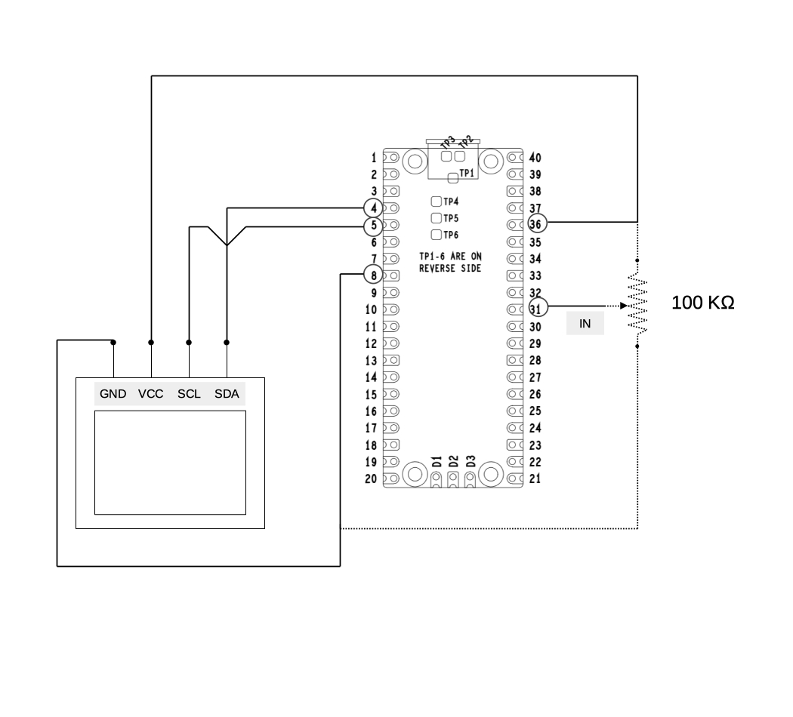
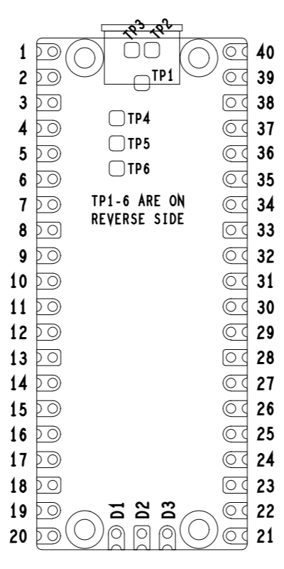

# ADC VIEWER

## project description

This is a viewer on display of the values sampled by the ADC; in practice the "poor man's oscilloscope"

The ADC reads an analog input, then the value is shown someway on the display.

This is the base building block for various measurement devices.

In the schematic the input is represented by the center tap of the potentiometer (pin 31) as in the test setup, but of course in real life application it can be any analog output in the ADC input voltage range.

## Schematic

